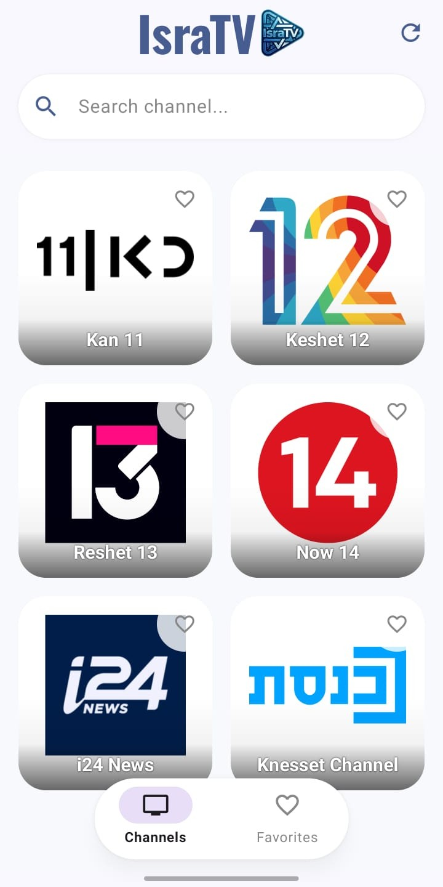
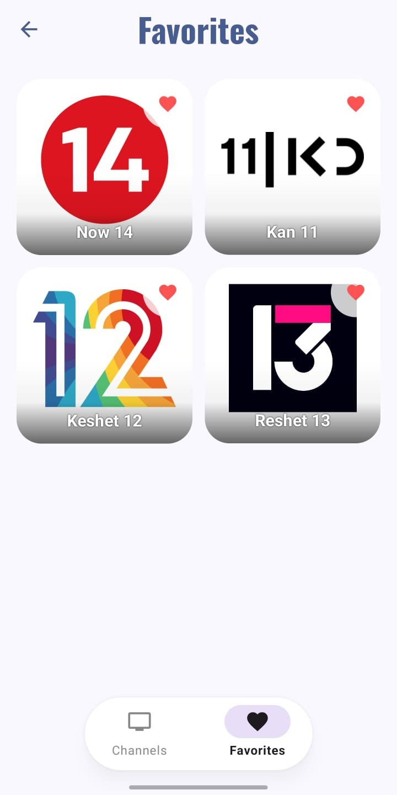

   
  <b>IsraTV</b> 

---
A modern Android application for streaming Israeli TV channels in real-time, built with **Jetpack Compose**. This app provides a smooth, fast, and personalized viewing experience.

## Key Features
* **Modern UI:** High-performance interface built with Jetpack Compose.
* **Favorites:** Save channels to a personal list via local **Room DB**.
* **Picture-in-Picture (PiP):** Watch in a floating window while using other apps.
* **Smart Search:** Find channels instantly by name.
* **Advanced Player:** Optimized HLS streaming powered by **ExoPlayer**.
* **Auto-Updates:** Automatically checks for and installs new versions within the app.

## Screenshots
| Channel List | Video Player |
| :---: | :---: |
|  |  |

## Installation
You can download the latest installation file (APK) directly from the [Releases](https://github.com/BitBOY21/IsraTV-app-android-Israel-IPTV/releases) section.

## Content & Updates
The app ensures a reliable viewing experience through a triple-layered system:
* **In-App Updates:** The app now checks for the latest version on startup and offers a seamless integrated update flow.
* **Smart Sync:** Combines a built-in channel list with automatic cloud updates for stream links.
* **Live Maintenance:** Remote management of stream URLs to fix broken links in real-time.

## ⚠️ Legal Disclaimer
* **Educational Purposes Only:** This project was developed for learning Android development and video integration.
* **Copyright:** The developer does not own the broadcast rights. The app is a **player only** for publicly available streams.
* **Responsibility:** The app does not host content and is not responsible for the legality or maintenance of third-party sources.
