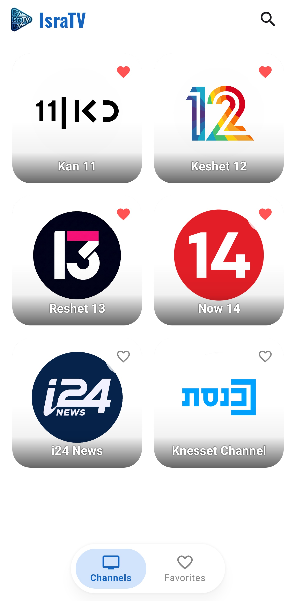
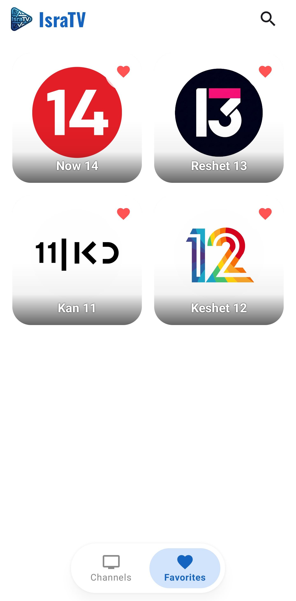

  <h1>
    
    IsraTV
  </h1>
  

    A modern Android application for streaming Israeli TV channels in real-time. 
  

  

## ✨ Key Features
* **Modern UI:** High-performance interface built with Jetpack Compose.
* **Favorites:** Save channels to a personal list via local **Room DB**.
* **Picture-in-Picture (PiP):** Watch in a floating window while using other apps.
* **Background Audio / Audio-Only:** Seamless continuous listening with dedicated background audio playback.
* **Smart Search:** Find channels instantly by name.
* **Advanced Player:** Optimized HLS streaming powered by **ExoPlayer**.
* **Auto-Updates:** Automatically checks for and installs new versions within the app.

## 📱 Screenshots
| Channel List | Video Player |
| :---: | :---: |
|  |  |

## 📥 Installation
Download the latest installation file (APK) directly from the [Releases](https://github.com/BitBOY21/IsraTV-app-android-Israel-IPTV/releases) section.

## 💬 Community & Updates
Join our official Telegram channel for updates, releases, and support:
* 🚀 **Release Announcements:** Instant notifications and direct APK downloads.
* 🛠 **Bug Reports:** Quick reporting for broken streams or player issues.
* 💡 **Feature Requests:** Suggest new channels and UI improvements.

👉 **[Join the Telegram Community (t.me/IsraTVApp)](https://t.me/IsraTVApp)**

## 🔄 Content & Updates
The app ensures a reliable viewing experience through a triple-layered system:
* **In-App Updates:** Checks for the latest version on startup and offers a seamless update flow.
* **Smart Sync:** Combines a built-in channel list with automatic cloud updates for stream links.
* **Live Maintenance:** Remote management of stream URLs to fix broken links in real-time.

## ☕ Support the Project
IsraTV is a free and open-source project. If you enjoy using the app and want to support ongoing development:
* **GitHub Sponsors:** [Sponsor via GitHub](https://github.com/sponsors/BitBOY21)
* **Telegram:** [Support via Telegram Channel](https://t.me/IsraTVApp)

## ⚠️ Legal Disclaimer
* **Educational Purposes Only:** Developed for learning Android development and video playback integration.
* **Copyright:** The developer does not own broadcast rights. The app is a player only for publicly available streams.
* **Responsibility:** The app does not host content and is not responsible for the legality or maintenance of third-party sources.
